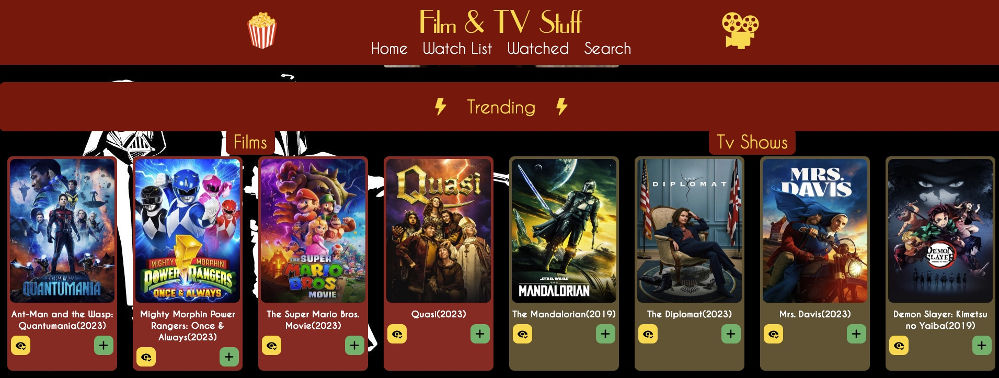
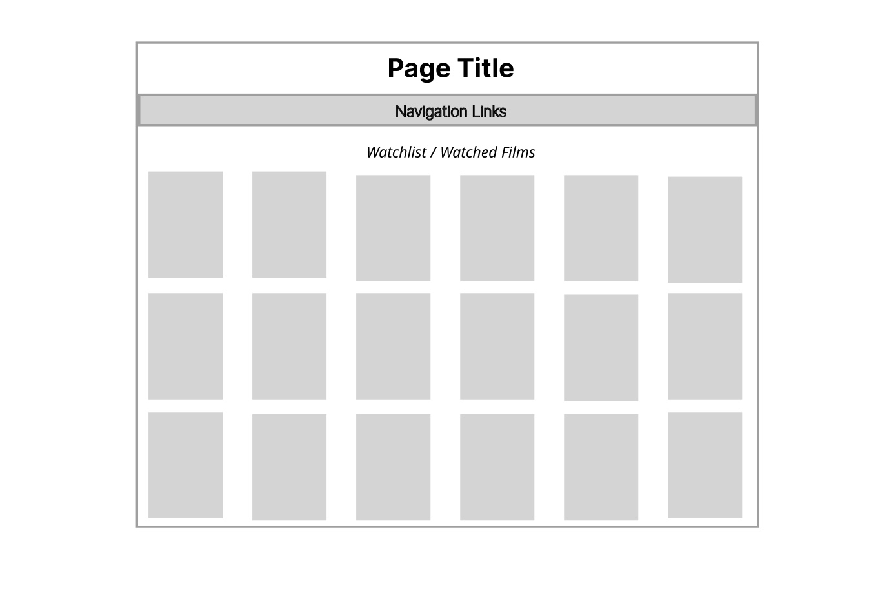
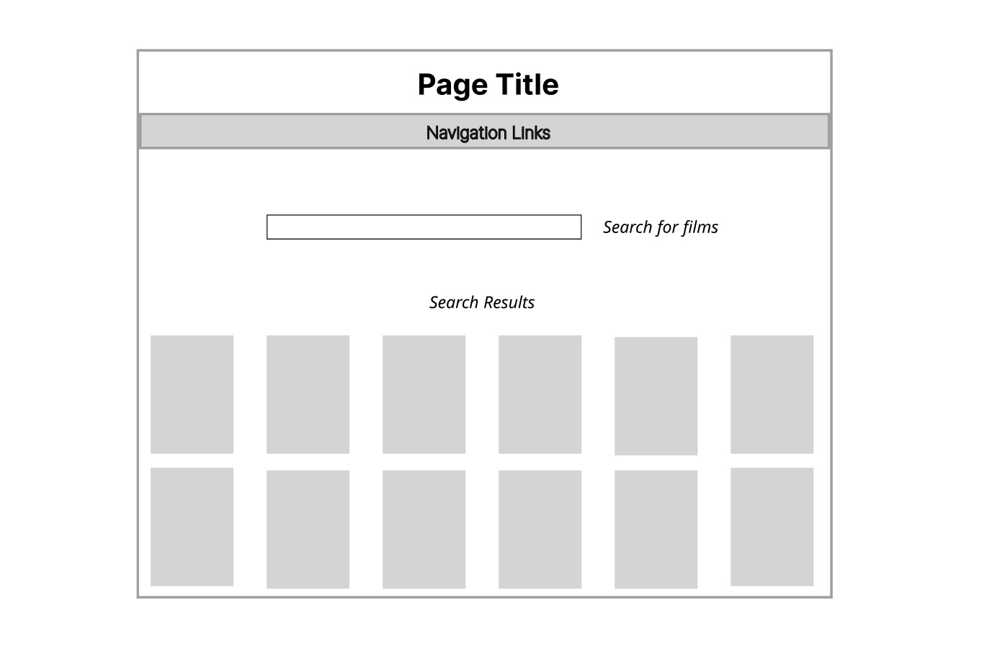
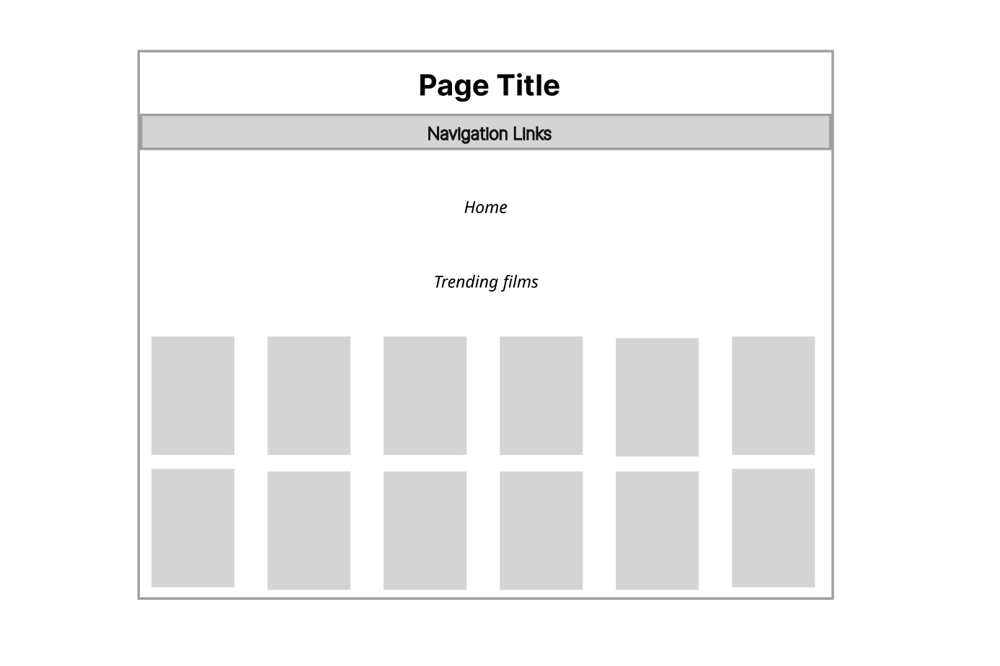
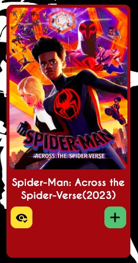
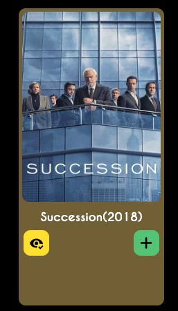
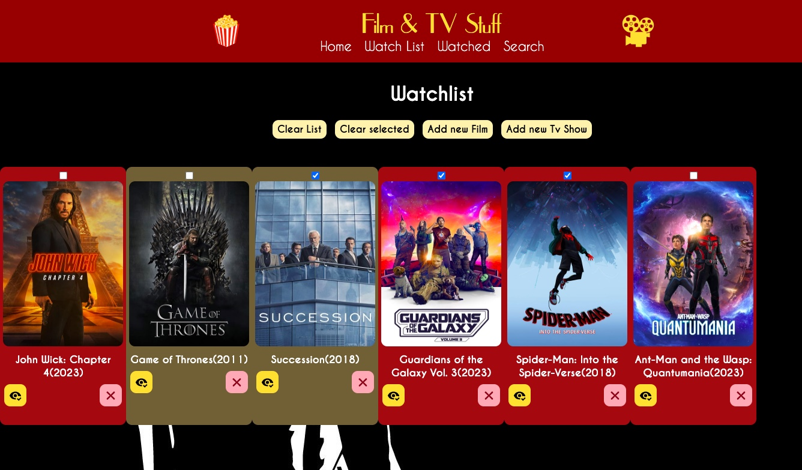
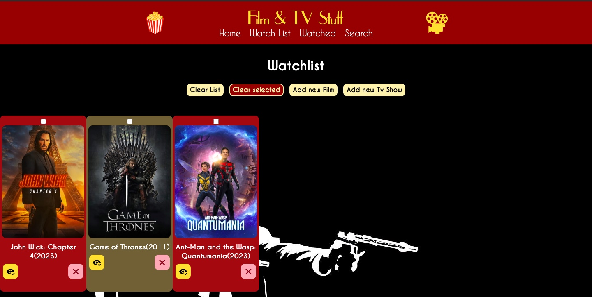
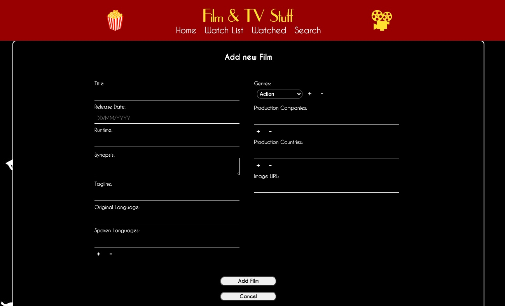
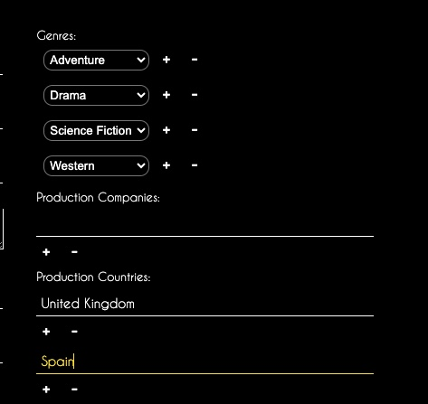

# Project 2 - React List App (Revisited)

## Overview

1. [Description](#description)
2. [Deployment Link](#deployment-link)
3. [Installation](#installation)
4. [Technologies Used](#technologies)
5. [Deliverables](#deliverables)
6. [Planning](#planning)
7. [Build Process](#build-process)
8. [Challenges](#challenges)
9. [Wins](#wins)
10. [Key Learnings & Takeaways](#takeaways)
11. [Future Improvements](#future-improvements)

## <a name="description"></a> 1. Description

A movie and tv watchlist application with full CRUD functionality built from scratch in 8 days using ReactJS/SCSS.
This solo project is the updated version of the second project I built as part of the curriculum for the General Assembly Software Engineering Immersive Course, with the objective of building a front-end list-based application that updates the UI and makes requests to a third-party API. <br>

The user can add movies and tv shows to a 'watched' and a 'to-watch' list, mark them as watched as well as edit and remove them from the list. By clicking on cover art of a film and or tv show, more information is displayed about the title, along with the option to watch a trailer. The user can also has the search for and add movies and tv shows from the public TMDB API to their lists and modify/remove them. <br>

This updated version of the project is fully responsive for easy navigation on all screen sizes and connects to firestore/firebase allowing users to create an account and save their data.

<br>



---

## <a name="deployment-link"></a> 2. Deployment link

- deployment link: https://film-tv-stuff.katieloesch.co.uk/

<br>

- original project repo: https://github.com/katieloesch/project-2-react-film-app

## <a name="installation"></a> 3. Installation

- package manager used: npm - v9.6.7
  - https://www.npmjs.com/package/npm
- to install dependencies, run:

```zsh
npm install
```

## <a name="technologies"></a> 4. Technologies Used

This application is based in ReactJS(v18.2.0), JavaScript, JSX and CSS.

Additional components:

- react-router (v6.10.0)
  - https://www.npmjs.com/package/react-router
- react-youtube (v10.1.0)
  - https://www.npmjs.com/package/react-youtube
- react-icons
  - https://www.npmjs.com/package/react-icons

### Additional tools used:

- Figma: design tool used for building the wireframe
  - https://www.figma.com/
- Visual Studio Code (VSCode)
  - code editor used for writing CSS, JSX and JavaScript
  - https://code.visualstudio.com/
- Google Chrome browser
  - used for launching the website and displaying the application Google Chrome
  - Google Chrome Developer Tools: For troubleshooting and debugging
  - https://www.google.com/intl/en_uk/chrome/
- Git / GitHub: version control
  - https://git-scm.com/
  - https://github.com/https://github.com/

### External web resources:

- icons

  - iconify (open source svg library)
    - https://iconify.design/
  - react-icons
    - https://www.npmjs.com/package/react-icons
    - https://react-icons.github.io/react-icons/

- sourcefonts: FontSquirrel (https://www.fontsquirrel.com/)
  - caviarDreams (https://www.fontsquirrel.com/fonts/caviar-dreams)
  - upperEastSide (https://www.fontsquirrel.com/fonts/uppereastside)
- API used: TMDB - The Movie Database
  - https://www.themoviedb.org/?language=en-GB

## <a name="deliverables"></a> 5. Deliverables

- Build a web application from scratch using the create-react-app command.
- Plan application using wireframes and user stories
- Deploy app online to GitHub Pages, Surge, or any hosting service
- the user must be able to:
  - Add a new item to a list
  - Mark the item as complete/favourite/(watch, read, listen) later/flag/etc
  - Edit an item from a list
  - Remove an item from a list
  - Clear/delete all items
  - Clear/delete only marked items
- Fetch data from at least one 3rd party API using Axios or fetch.
- Make frequent Git commits with descriptive messages, explaining your commit.
- Use React Router to handle multiple pages/views.

### Potential Extra Features

- incorporate another 3rd Party API in your application
- use React.Context to pass props down to children
- make the app responsive
- save the data to localStorage or an API
- use 1 or more 3rd party libraries
- use a React component library like Ant Design, Bootstrap React, or Material UI
- use a CSS library like Bootstrap
- add user sign up, sign in and sign out with Firebase and React Authentication

### User stories

- As a user, I should be able to add a movie to my watchlist.
- As a user, I should be able to mark a movie as watched.
- As a user, I should be able to remove a movie from my watchlist.
- As a user, I should be able to clear all movies from my watchlist.
- As a user I should be able to clear a selection of movies from the watchlist.
- As a user, I should be able to search for movies from an external source.
- As a user, I should be able to edit a movie.

## 6. <a name="planning"></a> Planning

The plan was to create an intuitive and simple interface where the user can see the cover images of movies and tv shows so they can start adding different titles to their watchlist:



A search page should allow the user tolook for different movie/tv title from the TMDB API:



The Landing page should show some trending films and tv shows that the user can add to their watchlist as well:



---

## 7. <a name="build-process"></a> Build Process

### Day 1 - 14/04/2023

After brainstorming project ideas, I decided to settle on an application that enables the user to make lists of movies and tv shows they want to watch or have seen before.
I then proceeded to creating a wireframe on figma and looked into different entertainment APIs and decided on TMDB (the Movie Database).
https://www.themoviedb.org/?language=en-GB

After initialising a git repo, I started building the application using the 'create-react-app' command and also installed react router:

```zsh
npx create-react-app project-2-react-fil-app
npm install react-router

```

### Day 2 - 15/04/2023

On the second day I set up react router for 4 the different pages:

- homepage
- watchlist
- watched list
- search

I then requested a key for the TMDB database to retrieve the data and set up the basic layout and css for my application.
I also searched for some custom fonts on fontsquirrel and decided on 2 fonts that I felt would suit my project: Caviar Dreams and Upper East Side.

### Day 3 - 16/04/2023

On the third day I focused on adding more CSS to the homepage. I also made it display some trending tv shows and movies that are fetched from the TMDB API whenerver the homepage loads. I made the film and tv titles appear in different colours so they're easily distinguishable. Finally, I read up on the useEffect hook so the API data call is only made when the page first loads without repeated re-loads.

### Day 4 - 17/04/2023

I thought it would be nice to give the user the option to click on diffrent film/tv titles to view more details about the title they clicked on. So on the 4th day of developmen I focused on making a details page appear whenever a film/tv card is clicked. I then moved on to creating buttons for the film/tv card and corresponding functionality to add and remove them from the watchlist.

 

### Day 5 - 18/04/2023

The fifth day of development was mainly focused on deployment of the project. I GitHub pages as a deployment platformm.
I also added some functionaliy to the watchlist allowing the user to delete multuple elements at the same time by selecting a checkbox.




### Day 6 - 19/04/2023

On day 6 of the development phase I focused on the form for getting user input. Apart from selecting movies and tv shows from the API, the user should also be able to add their own titles to their watchlist.


For fields such as production countries, companies and genres, I wanted the user to be able to enter more than one string so I decided to enable to user to dynamically generate more input fields by clicking + / - buttons next to the input fields.



I achieved this by creating a variable that holds an array of the values of each field, in the example below counryFields, holding the value entered into each 'Production Country' field. When the '+' icon is clicked by the user, a new empty field is added to the countryFields variable.

I mapped over the items in this variable in the JSX section of the code and for each item in the countryfields array, an input field with corresponding + / - buttons is created. The key attribute of each generated input field is set equal to the index of the field in the array. This is important because when the '-' button is clicked, the function that deletes an input field needs to know which field to remove and takes the index number as an argument.

```JavaScript

const [countryFields, setCountryFields] = useState([{name: ''}])

function addCountryField(){
 setCountryFields([...countryFields, {name: ''}])
}

function removeCountryField(index) {
  if (index > 0) {
    const fields = [...countryFields]
    fields.splice(index, 1)
    setCountryFields(fields)
  }
}

```

```JSX

<li>Production Countries:

      {countryFields.map((field, index) => {
        return (<div key={index}>
        <input name='production_countries' value={field.name} onChange={(e) => handleCountryField(e, index)}></input>
        <button type="button" className='btn input-btn' onClick={addCountryField}>+</button>
        <button type="button" className='btn input-btn' onClick={() => removeCountryField(index)}>-</button>
        </div>)
      })}
</li>

```

### Day 7 - 20/04/2023

On day 7 I tackled the last element that I was missing for the MVP: editing items on the list. For this I used the same form as the form for adding new titles, filling in the form field with the current values for a title and allowing the user to make changes. I also got working on the readme file detailing my work process.

### Day 8 - 21/04/2023 - Submission Deadline 9:00AM

On the final day, I presented the project to my cohort and submitted my work.

### Post submission updates

#### 02/07/2023

I continued working on this project after submission. The first update I made was incorporating React.useContext to pass variables and function down to child components rather than using props.

Since submitting this project I have also developed a preference for useing SCSS over CSS so another change I made is to change all the CSS files to SCSS.

I also decided to move the forms for adding and editing film and tv titles as well as the details display to separate routes rather than using modals as I felt that would make it more straightforward to implement responsive design later on.

#### 12/07/2023

Another addition is the incorporation of firebase and firestore to store user data. In the original project, none of the items added to wishlists persisted after reload. I used firebase for user accounts and authenication and cloud firestore to store each user's lists of to-watch and watched titles.

## 8. <a name="challenges"></a> Challenges

- The main issue I got stuck on during this project was when editing items in the watchlist. Originally they wouldn't update immediatedly in the list and it would take changing tabs for changes to show up. One of the GA instructors then pointed out that I was not passing the setState function down as props. Once I did that it fixed the lagging issue.
- I also realised that takings breaks when stuck and doing other work and come back to a problem at a later stage can be helpful. Aditionally, getting a fresh pair of eyes on a problem can speed the bug fixing process along as well.

## 9. <a name="wins"></a> Wins

- I managed to complete all the MVP requirements for this project.
- I managed to retrieve data from the TMDB API, process it and display it on the front end without any major issues.
- Adding and removing input fields dynamically seemed complicated at first but once I understood the underlying logic it was easy to implement and makes adds to the aesthetic for the UI.

## <a name="takeaways"> 10. Key Learnings & Takeaways

- Working on this project has definitely improved my understanding of React and APIs.
- I want to spend more time learning and practising responsive design as this is something I didn't have the time to fully implement for this project.
- This project also taught me that getting stuck while building an application is normal.
- Studying error messages carefully can help improve my code and make it more robust.
- Planning different react components and props chain more carefully before starting to build them is worthwhile.

## <a name="future-improvements"></a> 11. Future Improvements

- incorporating additional APIs
- use React.Context to pass props down to children
- making the app responsive
- save the data to localStorage or an API
- add User Sign Up, Sign In, and Sign Out with Firebase and React Authentication
